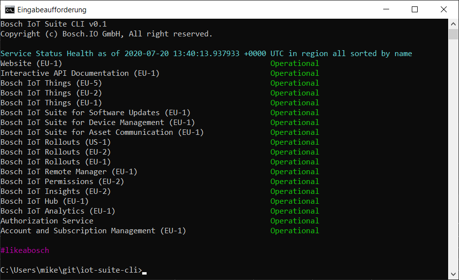

# iot-suite-cli

A command line tool for Bosch IoT Suite.

## Run application (Windows)

  Running `iot-suite-cli.exe` on the Command Line (cmd.exe) will display a short help screen
  and explain how to use the tool.
  
  Run the tool once to get an empty `config.yaml` file. Then edit the file and provide the
  configuration parameters (such as clientId, clientSecret and scope). You can create
  a new OAuth client at [https://accounts.bosch-iot-suite.com/oauth2-clients/](https://accounts.bosch-iot-suite.com/oauth2-clients/).
  
  You can also specify and override configuration options on command line, e.g.
  
     iot-suite-cli --clientId <CLIENTID> --clientSecret <SECRET> --scope <SCOPE>
  
  After registering a new Bosch ID account, create a new subscription and then create a new OAuth client.
  When the OAuth client has been created, copy the Client ID, Client Secret and Scope into the `config.yml`
  into the appropriate parameters.
  
  
    clientid: "<COPY_CLIENT_ID_HERE>"
    clientsecret: "<COPY_CLIENT_SECRET_HERE>"
    fields: thingId,attributes,features
    region: all
    scope: "<COPY_OAUTH_SCOPES_HERE>"
    sort: name
    verbose: false
  
  Please note that the scope must not be URL Encoded. If you have multiple scopes, use a space as delimiter. On the 
  command line using the `--scope` option, you may need to use quotes if you have multiple scopes.
  
## Functionality
  
  Service Status Overview: `iot-suite-cli.exe status`
   
  Authorize your OAuth Client: `iot-suite-cli.exe auth`
  
  Retrieve a list of Things: `iot-suite-cli.exe things`
     
## Screenshot
 
  

## Building

1. Prerequisite: Install Go from [https://golang.org/](https://golang.org/)
2. Clone the Git repository `git clone https://github.com/mikehaller/iot-suite-cli`
3. Install necessary dependencies with `go get -v .`
4. Build the binary with `go build .`
5. Run the binary with `iot-suite-cli.exe` 
 
